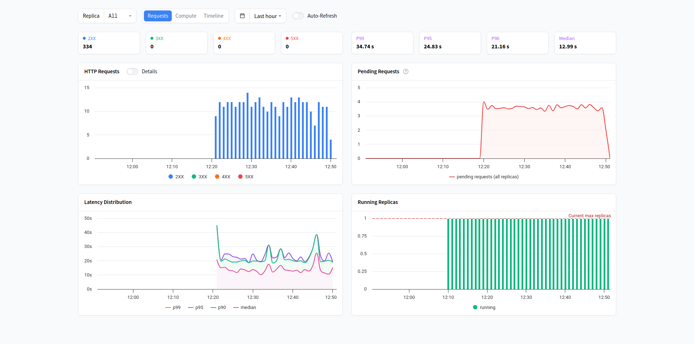

```bash
python -m evaluating_llms.instructions_dataset
python -m evaluating_llms.prompts_generator
python -m evaluating_llms.answers_local_generator
python -m evaluating_llms.answers_remote_generator
python -m evaluating_llms.answers_dataset
```

## Inference

Some of the execution

| Model | Inference Server | Generated Answers | Batch Size | Time Elapsed | Answers / Second |
| --- | --- | ---: | ---: | ---: | ---: |
| meta-llama-3.1-8b-instruct | Local (8GB VRAM) | 248 | 1 | 9h 25m 52s | 0.007 |
| twinllama-3.1-8b | HuggingFace Endpoint (16GB VRAM) | 334 | 4 | 18m 48s | 0.30 |
| twinllama-3.1-8b-dpo | HuggingFace Endpoint (16GB VRAM) | 334 | 4 | 29m 30s | 0.19 |

The price of such the HuggingFace inference endpoints was $0.5 / hour.



### Deprecated Classes

The local inference class was removed from the code base to keep it as simple as possible. Anyway, for traceability, it's code will be kept here:

```python
import os
from dotenv import load_dotenv
from warnings import deprecated

import torch
from huggingface_hub import login
from langchain_huggingface.llms import HuggingFacePipeline
from langchain_huggingface import ChatHuggingFace
from transformers import BitsAndBytesConfig

from evaluating_llms.prompts_generator import PromptsGenerator

@deprecated
class AnswersLocalGenerator:
    def __init__(self, model_id: str | None = None, prompts_generator: PromptsGenerator = PromptsGenerator()):
        load_dotenv()
        login(token=os.getenv("HUGGINGFACEHUB_API_TOKEN"))

        bnb_config = BitsAndBytesConfig(
            load_in_4bit=True,
            bnb_4bit_use_double_quant=True,
            bnb_4bit_quant_type="nf4",
            bnb_4bit_compute_dtype=torch.float16
        )

        llm = HuggingFacePipeline.from_model_id(
            model_id=model_id,
            device=0 if torch.cuda.is_available() else -1,
            task="text-generation",
            pipeline_kwargs={
                "max_new_tokens": 4096,
                "temperature": 0.8,
                "top_p": 0.95,
                "return_full_text": False,
                "clean_up_tokenization_spaces": True,
            },
            model_kwargs={
                "quantization_config": bnb_config,
                "dtype": torch.float16,
                "low_cpu_mem_usage": True,
            }
        )

        self.model_id = model_id
        self.model = ChatHuggingFace(llm=llm)
        self.prompts_generator = prompts_generator

    def generate(self):
        for record in self.prompts_generator.generate():
            answer = self.model.invoke(record["prompt"])
            record["answer"] = answer.content
            yield record
```