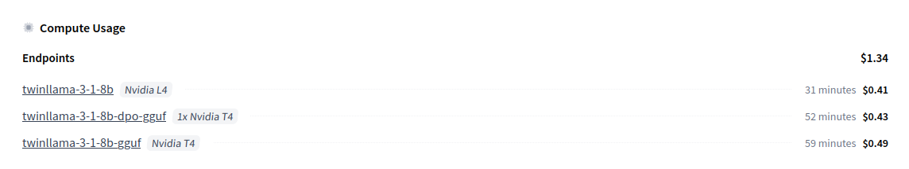
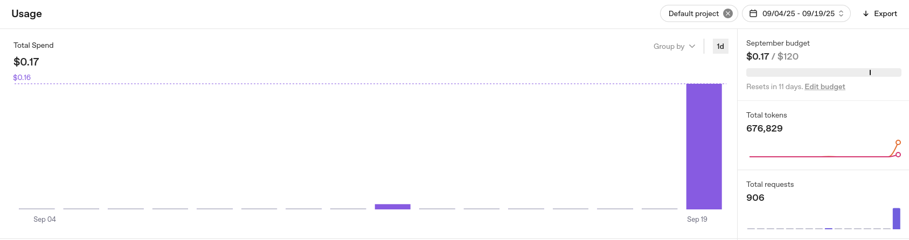

# LLM Engineer's Handbook · Evaluating LLMs

This repository contains my personal implementation of the coding part from Chapter 7 of the LLM Engineer's Handbook, focusing on **evaluating LLMs** (Large Language Models).

## About the Project

This project was developed as part of my studies with the [AI from Scratch](https://luma.com/ai-from-scratch) study group. Rather than following the book's code exactly, I've rewritten it from scratch to deepen my understanding of the concepts.

## Installation

To set up this project on your local machine:

### Clone the repository

```bash
git clone https://github.com/elcapo/llm-engineers-handbook-evaluating-llms.git
cd llm-engineers-handbook-evaluating-llms
```

### Create and activate a virtual environment

```bash
python -m venv .venv
source .venv/bin/activate
```

### Install the required dependencies

```bash
pip install -r requirements.txt
```

### Set up your environment variables

```bash
cp env.example .env
```

Then edit the `.env` file to add your Hugging Face API token.

## Usage

The project includes several CLI scripts to help you evaluate LLMs:

### Preview Instructions

View the first few instructions from the dataset:

```bash
./preview_instructions.py
```

An example of the output can be found in [instructions.txt](./assets/texts/instructions.txt).

### Preview Prompts

View the first few prompts generated from the instructions:

```bash
./preview_prompts.py
```

An example of the output can be found in [prompts.txt](./assets/texts/prompts.txt).

### Preview Answers

Preview answers generated by a specific model:

```bash
./preview_answers.py <model_id> [endpoint_url]
```

Examples:
```bash
./preview_answers.py meta-llama/Meta-Llama-3.1-8B-Instruct
./preview_answers.py mlabonne/TwinLlama-3.1-8B-GGUF https://endpoint-url.location.provider.endpoints.huggingface.cloud
```

An example of the output for each model can be found in:

* [meta-llama-3.1-8b-instruct.txt](./assets/texts/answers/meta-llama-3.1-8b-instruct.txt)
* [twinllama-3-1-8b-gguf.txt](./assets/texts/answers/twinllama-3-1-8b-gguf.txt)
* [twinllama-3-1-8b-dpo-gguf.txt](./assets/texts/answers/twinllama-3-1-8b-dpo-gguf.txt)

### Generate Answers

Generate and save all answers for a specific model:

```bash
./generate_answers.py <model_id> [endpoint_url]
```

Examples:
```bash
./generate_answers.py meta-llama/Meta-Llama-3.1-8B-Instruct
./generate_answers.py mlabonne/TwinLlama-3.1-8B-GGUF https://endpoint-url.location.provider.endpoints.huggingface.cloud
```

The generated datasets of **answers** in JSONL format can be found in:

* [meta-llama-3.1-8b-instruct.jsonl](./datasets/answers/meta-llama-3.1-8b-instruct.jsonl)
* [twinllama-3.1-8b.jsonl](./datasets/answers/twinllama-3.1-8b.jsonl)
* [twinllama-3.1-8b-dpo.jsonl](./datasets/answers/twinllama-3.1-8b-dpo.jsonl)

#### Inference Performance

Below is a comparison of inference performance across different models and setups:

| Model | Inference Server | Generated Answers | Batch Size | Time Elapsed | Answers / Second |
| --- | --- | ---: | ---: | ---: | ---: |
| meta-llama-3.1-8b-instruct | Local (8GB VRAM) | 248 | 1 | 9h 25m 52s | 0.007 |
| twinllama-3.1-8b | HuggingFace Endpoint (16GB VRAM) | 334 | 4 | 18m 48s | 0.30 |
| twinllama-3.1-8b-dpo | HuggingFace Endpoint (16GB VRAM) | 334 | 4 | 29m 30s | 0.19 |


##### Cost Summary

* The HuggingFace inference endpoints were priced at $0.5 per hour.
* The entire process had a total cost of $1.34.



### Evaluate Answers

Evaluate all answers for a specific model:

```bash
./evaluate_answers.py <model_id>
```

Examples:
```bash
./evaluate_answers.py meta-llama/Meta-Llama-3.1-8B-Instruct
```

The generated datasets of **answers** in JSONL format can be found in:

* [meta-llama-3.1-8b-instruct.jsonl](./datasets/evaluations/meta-llama-3.1-8b-instruct.jsonl)
* [twinllama-3.1-8b.jsonl](./datasets/evaluations/twinllama-3.1-8b.jsonl)
* [twinllama-3.1-8b-dpo.jsonl](./datasets/evaluations/twinllama-3.1-8b-dpo.jsonl)

#### Evaluation Performance

Below is a comparison of the evaluation performance for each of the models, although OpenAI was the "LLM judge" in all cases.

| Evaluated Model | Evaluated Answers | Batch Size | Time Elapsed | Answers / Second |
| --- | ---: | ---: | ---: | ---: |
| meta-llama-3.1-8b-instruct | 334 | 4 | 5m 25s | 1.03 |
| twinllama-3.1-8b | 334 | 4 | 5m 11s | 1.07 |
| twinllama-3.1-8b-dpo | 334 | 4 | 4m 23s | 1.27 |

##### Cost Summary

* The entire process had a cost of $0.17.



## Notes

The local inference class has been removed from the main codebase to keep it as simple as possible. For reference, the original code is still available at [assets/code/answers_local_generator.py](./assets/code/answers_local_generator.py).
